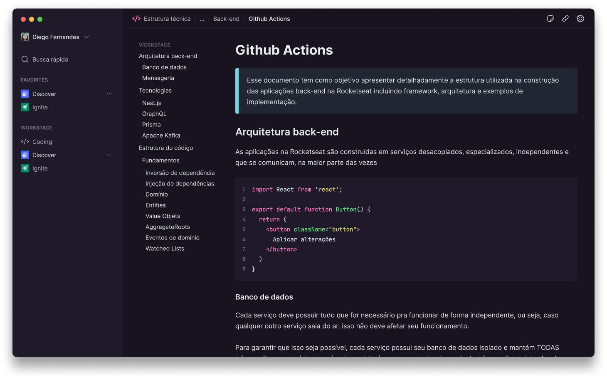

<h1 align="center"> Rotion </h1>

Rotion é uma aplicação desktop moderna construída com Electron que oferece uma experiência de escrita e organização de documentos semelhante ao Notion. Com uma interface elegante e intuitiva, o aplicativo permite criar, editar e gerenciar documentos de forma eficiente, proporcionando uma ferramenta poderosa para produtividade pessoal e profissional.

  <a href="#-tecnologias">Tecnologias</a>&nbsp;&nbsp;&nbsp;|&nbsp;&nbsp;&nbsp;
  <a href="#-projeto">Projeto</a>&nbsp;&nbsp;&nbsp;|&nbsp;&nbsp;&nbsp;
  <a href="#-layout">Layout</a>

  

## 🚀 Tecnologias

Esse projeto foi desenvolvido com as seguintes tecnologias:

- Electron
- TypeScript
- Vite
- Tailwind CSS
- Electron Store
- React Router DOM
- TipTap (Editor de texto rico)
- React Query (TanStack Query)
- Radix UI (Componentes acessíveis)
 

## 💻 Projeto

Rotion é uma aplicação desktop inspirada no Notion, desenvolvida com Electron e React. O projeto oferece uma experiência completa de criação e edição de documentos com as seguintes funcionalidades:

**✨ Funcionalidades Principais:**
- **Editor de Texto Rico**: Interface de escrita avançada com formatação em tempo real usando TipTap
- **Organização de Documentos**: Sistema de navegação lateral para gerenciar múltiplos documentos
- **Busca Rápida**: Funcionalidade de busca integrada para encontrar documentos rapidamente
- **Interface Responsiva**: Design moderno e responsivo com Tailwind CSS
- **Persistência Local**: Armazenamento local dos documentos usando Electron Store
- **Breadcrumbs Navegáveis**: Sistema de navegação hierárquica para melhor orientação
- **Sidebar Colapsável**: Interface adaptável para maximizar o espaço de escrita

**🛠️ Arquitetura Técnica:**
- **Processo Principal (Main)**: Gerenciamento de janelas, tray system e atalhos globais
- **Processo de Renderização (Renderer)**: Interface React com roteamento e estado global
- **IPC Communication**: Comunicação segura entre processos para operações de arquivo
- **Hot Module Replacement**: Desenvolvimento ágil com recarga instantânea

O projeto demonstra as melhores práticas de desenvolvimento Electron, incluindo segurança, performance e experiência do usuário, servindo como uma base sólida para aplicações desktop modernas.
 

## 🎨 Layout

Você pode visualizar o layout do projeto através [DESSE LINK](https://www.figma.com/file/oDWCeuEWPkoSJytDBuTax5/). É necessário ter conta no [Figma](https://figma.com) para acessá-lo.